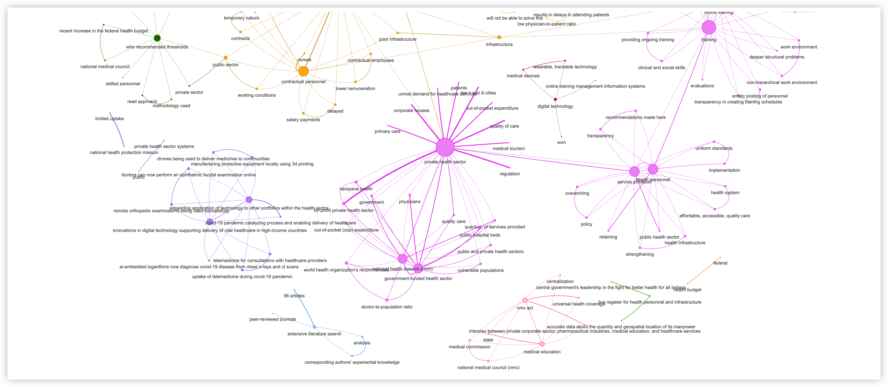
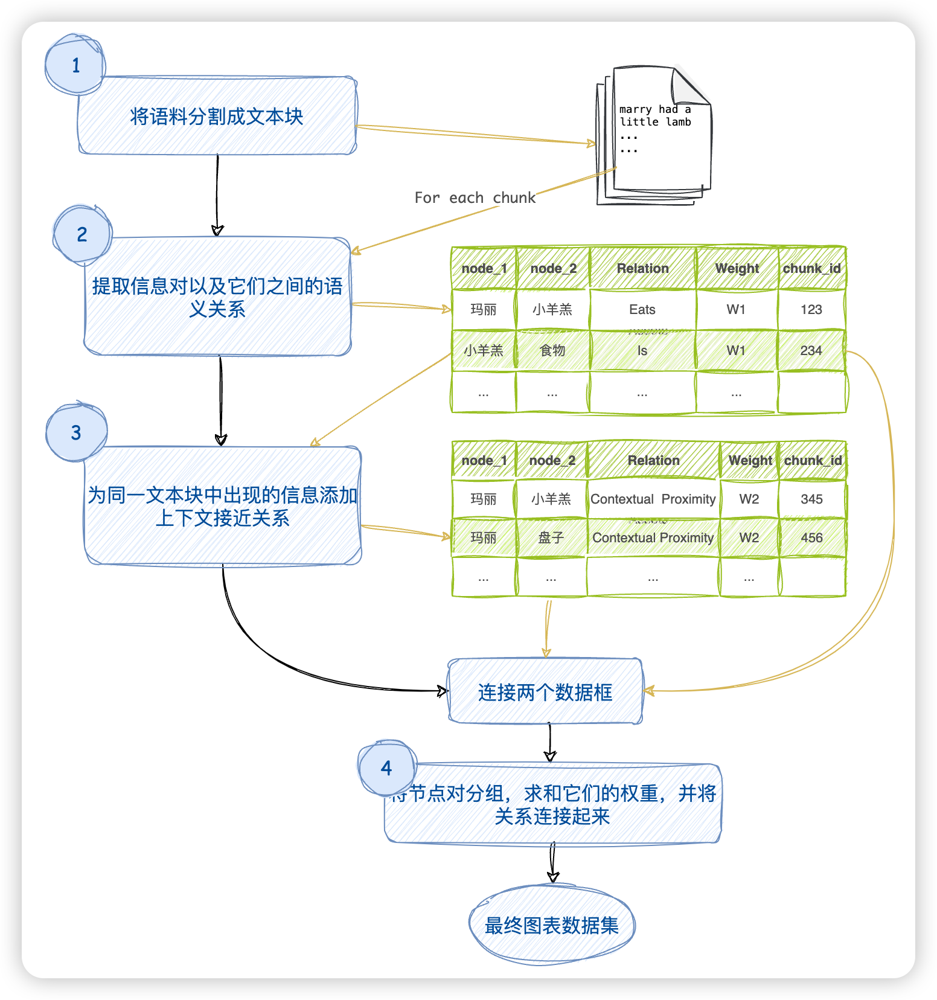

# 将任何文本语料库转化为 *知识图谱*

*使用此代码生成的知识图谱* 

## 什么是知识图谱？
知识图谱，也称为语义网络，表示现实世界实体的网络，即对象、事件、情境或概念，并说明它们之间的关系。这些信息通常存储在图数据库中，并以图形结构可视化，因此称为知识“图谱”。

来源: https://www.ibm.com/topics/knowledge-graph

## 如何从一篇作品中创建简单的知识图谱？
1. 清理文本语料库（作品）。
2. 从作品中提取概念和实体。
3. 提取实体之间的关系。
4. 转换为图架构。
5. 填充节点（概念）和边缘（关系）。
6. 可视化和查询。

第6步是完全可选的，但与此相关的确实有一定的艺术满足感。网络图是美丽的对象（只需看上面的横幅图，是不是很美？）。幸运的是，有许多Python库可用于生成图形可视化。

## 为什么使用图？
一旦建立了知识图谱（KG），我们可以用它进行许多用途。我们可以运行图算法并计算任何节点的中心性，了解一个概念（节点）对这篇作品有多重要。我们可以计算社区，将概念分组在一起以更好地分析文本。我们可以了解看似不相关的概念之间的关系。

最重要的是，我们可以实现图检索增强生成（GRAG），并使用图作为检索器以更深入地与我们的文档交流。这是**检索增强生成（RAG）**的新版本，其中我们使用向量数据库作为检索器，以便与我们的文档进行交互。

---

## 当前项目
在这里，我从一个PDF文档中创建了一个简单的知识图谱。我在这里遵循的过程与上述部分概述的过程非常相似，只是进行了一些简化。

首先，我将整个文本拆分为块。然后，我使用LLM从每个块中提取提到的概念。请注意，我这里不是使用NER模型提取实体。概念和实体有所区别。例如，'Bangalore'是一个实体，而'Bangalore宜人的天气'是一个概念。根据我的经验，与实体相比，概念更能形成有意义的KG。

我假设彼此靠近的概念是相关的。因此，图中的每条边都是在提到两个相连概念的文本块中。

一旦计算出节点（概念）和边（文本块），使用此处提到的库将它们易于创建图。

这里使用的所有组件都在本地设置，因此这个项目可以在个人计算机上轻松运行。我在这里采用了不使用GPT的方法以保持经济性。我使用了出色的Mistral 7B openorca instruct，在这个用例中表现出色。该模型可以在本地使用Ollama进行设置，因此生成KG基本上是免费的（不需要调用GPT）。

要生成图，您需要调整此笔记本。

**[extract_graph.ipynb](./ollama_knowlage_graph//extract_graph.ipynb)**

该笔记本实现了以下流程图中概述的方法。

1. 将文本语料库拆分成块。为这些块中的每一个分配一个块ID。
2. 对于每个文本块，使用LLM提取概念及其语义关系。让我们为这种关系分配一个权重W1。同一对概念之间可以有多个关系。每个这样的关系都是一对概念之间的边。
3. 考虑在同一文本块中出现的概念也通过它们的上下文接近。让我们为这种关系分配一个权重W2。请注意，同一对概念可能在多个块中出现。
4. 对相似的对进行分组，总结它们的权重，并连接它们的关系。因此，现在我们只有一对概念之间的一条边。该边具有一定的权重和一组关系作为其名称。

此外，还计算了每个节点的度和节点的共同体，用于在图中分别调整节点的大小和颜色。

---
## 技术栈

### Mistral 7B

我使用Mistral 7B Openorca从文本块中提取概念。它可以很好地遵循系统提示的说明。

### Ollama

Ollama使得在本地托管任何模型变得容易。Mistral 7B OpenOrca版本已经与Ollama一起提供，可立即使用。

要设置此项目，必须在本地机器上安装Ollama。

步骤1: 安装Ollama https://ollama.ai

步骤2: 在终端中运行ollama run zephyr。这将将zephyr模型拉到您的本地机器上并启动Ollama服务器。

### Pandas 
用于图架构的数据帧（可以在以后阶段使用图数据库）。

### NetworkX 
<a href="https://networkx.org"><a/>

这是一个使处理图变得非常容易的Python库

### Pyvis
[Pyvis Python库](https://github.com/WestHealth/pyvis/tree/master)用于可视化。Pyvis使用Python生成JavaScript图形可视化，因此最终的图形可以托管在web上。
