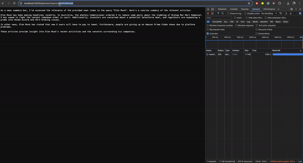

# GenAI 新闻搜索器

使用 Llama-3 和 Groq 快速实现 GenAI 新闻摘要代理。可在 6 秒内检索新闻并提供摘要。

## 如何使用？

### Install requirements

```
pip install -r server/requirements.txt
```

### 创建环境文件并添加环境变量

创建一个 `.env` 文件并添加以下内容。

```
GROQ_API_KEY="YOUR_GROQ_API_KEY"
GROQ_MODEL_NAME="llama3-8b-8192"

NEWS_API_KEY="YOUR_NEWS_API_KEY"
NEWS_BASE_URL="https://newsdata.io/api/1/"

BRAVE_API_KEY="YOUR_BRAVE_SEARCH_API_KEY"
```

### 启动 FastAPI 服务器

```
python server/app.py
```

## Demo

服务器将在端口号为 $8899$ 的端口上运行。然后，您可以通过以下方式与 `/api/news` 端点交互。

